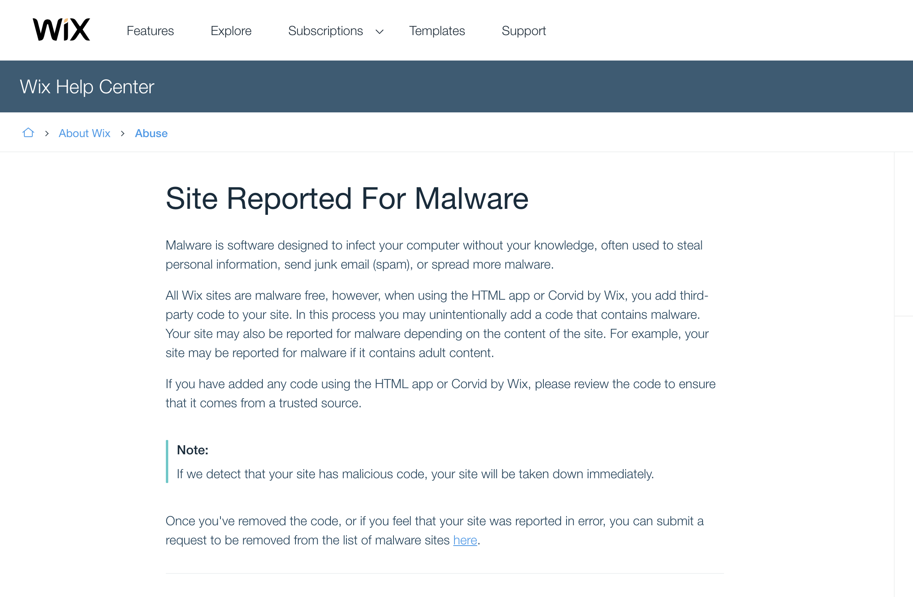

#  F.A.Q.

1. ¿Lo migro ya todo ya?

    No es necesario que migres, todavía hay soporte para las clases y lo seguirá habiendo.

2. No me enteré de nada

    🤷🏻‍♀️ Es mi primerita charla.

3. React Hooks con TypeScript

    Hay soporte

        const [state, setState] = useState<number | null>(null);
        // const state: number | null
        const [state, setState] = useState<{id: number, name: string} | null>(null);
        // const state: {id: number; name: string;} | null
        const [state, setState] = useState<number | undefined>(undefined);

4. Testing

    Puedes testear tus hooks sin problema, ya hay una librería especializada. Pero puedes continuar testeando tus componentes como antes.

        import { renderHook, act } from 'react-hooks-testing-library'
        import useCounter from './useCounter'
        
        test('should increment counter', () => {
          const { result } = renderHook(() => useCounter())
        
          act(() => result.current.increment())
        
          expect(result.current.count).toBe(1)
        })
        
        test('should decrement counter', () => {
          const { result } = renderHook(() => useCounter())
        
          act(() => result.current.decrement())
        
          expect(result.current.count).toBe(-1)
        })

5. Rendimiento

    Mejor de las clases, seguro

- Under the hood for dummies

    En pocas palabras, oor componente se reserva un espacio de memoria, los hooks hacen uso de ella de forma ordenada.

    [React hooks: not magic, just arrays](https://medium.com/@ryardley/react-hooks-not-magic-just-arrays-cd4f1857236e)

    [RFC: React Hooks by sebmarkbage · Pull Request #68 · reactjs/rfcs](https://github.com/reactjs/rfcs/pull/68#issuecomment-439314884)

1. Virus en páginas web hechas con Wix

    

    If you believe you have found a virus on a Wix site please report it to: [security-report@wix.com](mailto:security-report@wix.com).

    

    