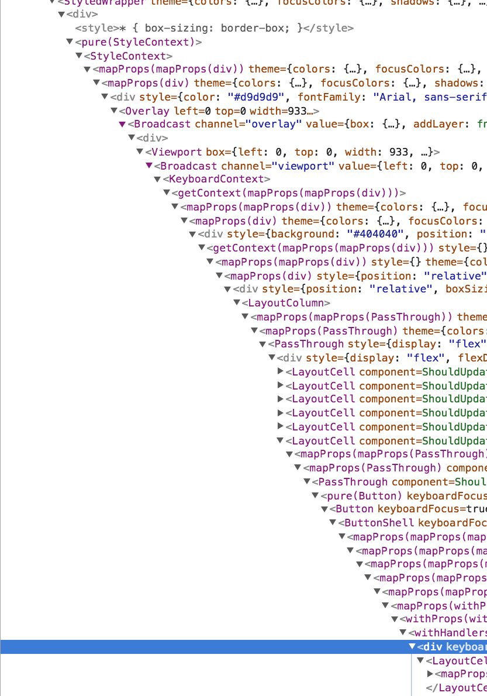

# Motivación

1. Problema

    Componentes enormes. Difíciles de entender, refactorizar y testear

    Lógica duplicada entre diferentes componentes y ciclo de vida

    Patrones complejos High Order Components y render props (Añaden complejidad al componente cuando lo que quieres es refactorizar)

    Evitar el Wrapper Hell

    

    - It's hard to reuse stateful login between components.

        Old solution: High Order Components, render props

        Good Solution: Reuse stateful logic without changing your components hiercharchy

    - Complex components become hard to understand

        Unrelated logic: Data fetching, event listeners. Combine in a single method. 

        Difficult to test

        Solution: Split one component into smaller functions based on what pieces are related

2. What is Hooks?

    Los Hooks te dan una nueva visión de React sin la complejidad de las clases

    Functions that give you React Features like state and lifecycle methods without classes.

3. Classes vs Hooks

        function useFormValue(initial) {
          const [value, setValue] = useState(initial);
          const onChange = evt => {
            setValue(evt.target.value);
          };
          return {
            value,
            onChange
          };
        }
        
        function useRandomJoke() {
          const [joke, setJoke] = useState();
          useEffect(() => {
            let isCancelled = false;
            fetch("https://api.chucknorris.io/jokes/random")
              .then(res => res.json())
              .then(res => !isCancelled && setJoke(res.value));
            return () => {
              isCancelled = true;
            };
          }, []);
          return joke;
        }
        
        function useSearchJokes(query) {
          const [searchResult, setSearchResult] = useState([]);
          useEffect(() => {
            if (query === "") return;
            let isCancelled = false;
            fetch(`https://api.chucknorris.io/jokes/search?query=${query}`)
              .then(res => res.json())
              .then(
                res =>
                  !isCancelled &&
                  setSearchResult((res.result || []).map(item => item.value))
              );
            return () => {
              isCancelled = true;
            };
          }, [query]);
        
          return searchResult;
        }
        
        function useWindowWidth() {
          const [width, setWidth] = useState(window.innerWidth);
          useEffect(() => {
            function updateWidth() {
              setWidth(window.innerWidth);
            }
            window.addEventListener("resize", updateWidth);
            return () => {
              window.addEventListener("resize", updateWidth);
            };
          }, []);
        
          return width;
        }
        
        function Greetings() {
          const { value, onChange } = useFormValue("");
          const joke = useRandomJoke();
          const searchResult = useSearchJokes(value);
          const width = useWindowWidth();
          return (
            

              
Window width: {width}

              <h1>Hello, {value}</h1>
              <input type="text" onChange={onChange} value={value} />
              
{joke}

              <ul>
                {searchResult.map(item => (
                  <li key={item}>{item}</li>
                ))}
              </ul>
            

          );
        }

    [https://twitter.com/prchdk/status/1056960391543062528](https://twitter.com/prchdk/status/1056960391543062528)

4. React Mixins

    ¿Pero no hay una solución para las clases? 

        var SubscriptionMixin = {
          getInitialState: function() {
            return {
              comments: DataSource.getComments()
            };
          },
        
          componentDidMount: function() {
            DataSource.addChangeListener(this.handleChange);
          },
        
          componentWillUnmount: function() {
            DataSource.removeChangeListener(this.handleChange);
          },
        
          handleChange: function() {
            this.setState({
              comments: DataSource.getComments()
            });
          }
        };
        
        var CommentList = React.createClass({
          mixins: [SubscriptionMixin],
        
          render: function() {
            // Reading comments from state managed by mixin.
            var comments = this.state.comments;
            return (
              

                {comments.map(function(comment) {
                  return <Comment comment={comment} key={comment.id} />
                })}
              

            )
          }
        });
        
        module.exports = CommentList;

    Colisionan los métodos, pierdes la trazabilidad del método. Diamond Problem

    

    

5. Las funciones se minifican mejor. El nombre de una propiedad de una clases tiene que ser siempre el mismo, pero como por ejemplo para el array que devuelve el useState, no importa como se llame. Además, el equipo de React está trabajando en formas de optimizar el transpilado y la minificación, están experimentando con un optimizador llamado Prepack, y las clases han dado serios problemas.
6. ¿Breaking changes?

    No hay breakings changes. Puedes continuar trabajando con Classes sin problemas. Facebook tiene montones de componentes hechos con clases y no recomiendan no migrarlos. Pero si que es verdad que si empiezas algo nuevo, recomiendan usar hooks.