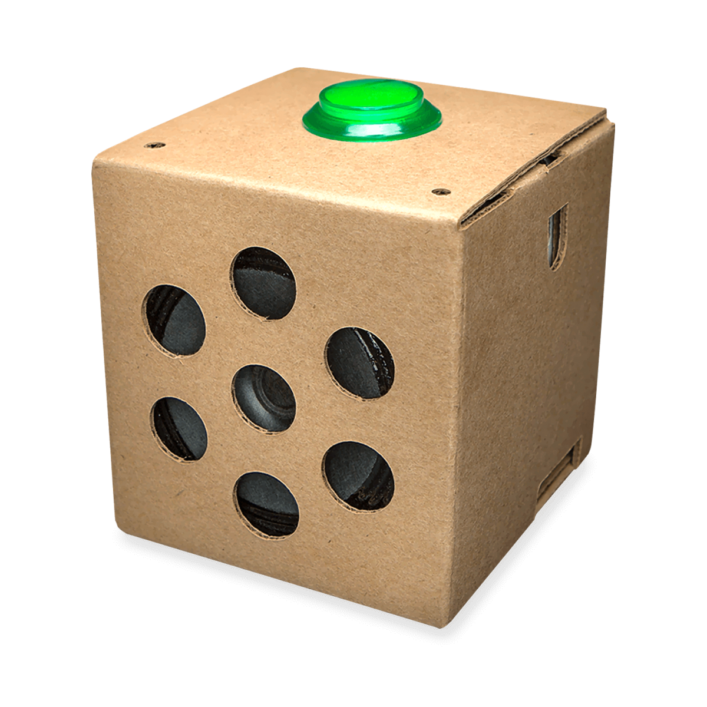

# Sobre mí

- Para meetup

    Quizás le recordaréis del evento de Codepen, señalando a un enorme JSON y diciendo "Esto es un Pokémon", pues ese. Además de asistente habitual del meetup y demás eventos de Alicante Frontend, le da a todo lo que hay en este mundillo tecnológico tanto en el trabajo como en su tiempo libre. Con un breve pasado como desarrollador Android, le da al frontend por la mañana y por la noche, de vez en cuando le oímos que también hace backend, big data y frikismos varios, suponemos que será verdad. A parte de eso, también tiene vida personal. Le gustan los cómics, las películas independientes y las basadas en cómics. Siempre nos anda diciendo que quiere ir al gimnasio, pero nunca va 🤷. 

Me recordaréis como el chaval que durante el evento del Codepen señaló a un enorme JSON y dijo "Esto es un Pokémon | Bulbasaur".

También me recordaréis si sois asiduos al GDG Alicante

También soy la persona que insultó a un asistente de Google, en concreto la cajita, durante la primera charla que hicieron en el GDG.

Hijo de !@#$% !

Soy Full Stack, toco de todo lo que puedas imaginar, me gusta meter la nariz en todas partes. Me gusta lo que hago. Actualmente trabajo en Suez, el que anteriormente era patrocinador, tiene sus más y sus menos, pero se está bastante bien.  He aprendido mucho allí, de todo lo que puedas imaginar. 

Fui al Vue Day. Me hice varias fotos para el anuncio de la charla, esta fue una de ellas.

